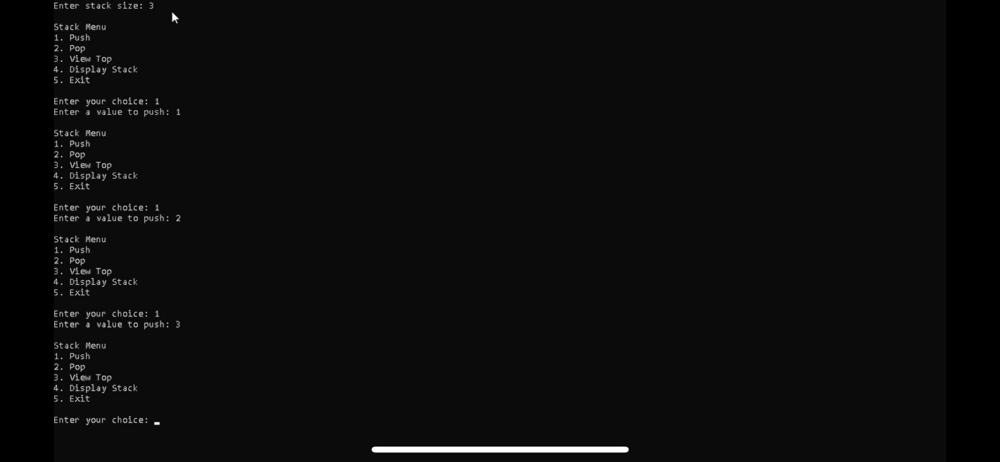

# Stack Data Structure

Explore my C++ Stack Data Structure project, featuring fundamental stack operations like push, pop, view, and display! This templated stack is highly flexible and allows you to define the type of elements stored. The project includes a base stack class, an extended implementation with myStack, and a menu-driven main program for interaction.



## Table of Contents
1. [Introduction](#introduction)
2. [Project Overview](#project-overview)
3. [Features](#features)
4. [Installation](#installation)
5. [Live Preview of the Program](#live-preview-of-the-program)
6. [File Structure](#file-structure)
7. [Technologies Used](#technologies-used)
8. [Code Explanation](#code-explanation)
9. [Future Improvements](#future-improvements)
10. [Conclusion](#conclusion)

## Introduction
This C++ project demonstrates a stack data structure built with templates, allowing for multiple data types. Through a menu-driven interface, users can perform key stack operations such as push, pop, view, and display, enabling a practical way to learn and use stack functionality in various scenarios. 

## Project Overview
The stack implementation in this project uses a templated base class (`Stack`) to define core stack attributes and functionality, such as checking for an empty or full stack. The derived class (`MyStack`) implements these functions and adds an intuitive menu-driven interface for user interaction.

## Features
- **Push**:  
  Adds a new element to the top of the stack if it isn’t full, ensuring stack growth until capacity.

- **Pop**:  
  Removes the top element from the stack and provides feedback if the stack is empty.

- **View Top Element**:  
  Displays the current top element without modifying the stack contents.

- **Display**:  
  Outputs all elements in the stack from bottom to top, enabling users to visualize the stack's contents.

## Installation
To run this **Stack Data Structure** program, ensure a C++ compiler (e.g., g++ or Visual Studio) is installed, then follow these steps:

1. **Download the Source Code**: Clone or download the files from this repository.

2. **Compile the Code**: Open a terminal, navigate to the project folder, and compile with:
   ```bash
   g++ Main.cpp -o Stack
   ```

3. **Run the Program**: Execute the compiled program with:
   ```bash
   ./Stack
   ```

## Live Preview of the Program
Experience the stack operations in action through a recording that demonstrates adding, viewing, and removing elements from the stack.

[`Screen Recording`](recording.mp4)

> **Note**: The recording quality has been adjusted to fit GitHub's 25MB limit.

## File Structure

- [`Stack.h`](Stack.h)  
  A templated base class defining core stack properties and abstract methods for derived classes.

- [`MyStack.h`](MyStack.h)  
  Implements the `Stack` base class functions, providing concrete stack behavior like checking empty/full status and performing operations.

- [`Main.cpp`](Main.cpp)  
  Contains the interactive, menu-driven program where users can create and manipulate the stack.

## Technologies Used

- **Software/Compilers**: Visual Studio, Visual Studio Code
- **Languages**: C++

## Code Explanation

This project uses two primary classes, `Stack` and `MyStack`, with an interactive [`Main.cpp`](Main.cpp) for user engagement.

- **Stack Class (Base)**:  
  Defines key properties such as `stackArray`, `stackTop`, and `maxSize`. This class serves as the foundation and declares abstract methods (`push`, `pop`, etc.) that derived classes must implement.

- **MyStack Class (Derived)**:  
  Inherits from `Stack` and provides implementations for each stack operation:
    - **Push**: Adds an element to `stackTop` while checking for overflow.
    - **Pop**: Decrements `stackTop` to remove the last element while ensuring underflow protection.
    - **View**: Returns the top element if the stack isn’t empty.
    - **Display**: Prints all stack elements from the bottom up.

## Future Improvements
- **Exception Handling**:  
  Implement C++ exceptions for handling stack overflows and underflows instead of printing messages to the console.

- **Resizable Stack**:  
  Enable dynamic resizing of the stack if it becomes full, allowing it to expand as necessary.

## Conclusion
This Stack Data Structure project in C++ demonstrates essential stack operations in a template-based design. The program’s menu-based interface is easy to use, providing practical experience with stack operations.
